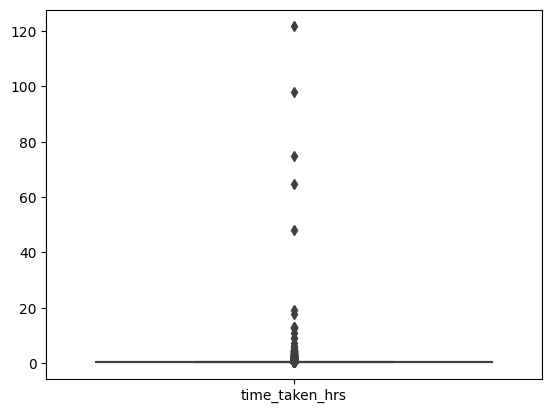
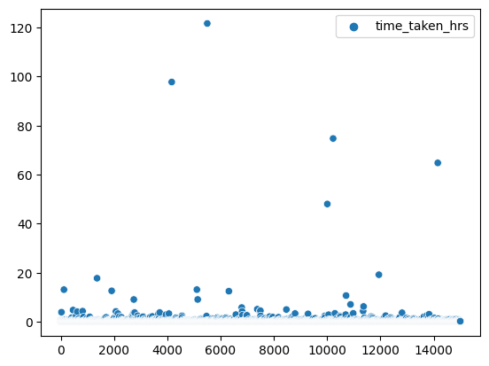
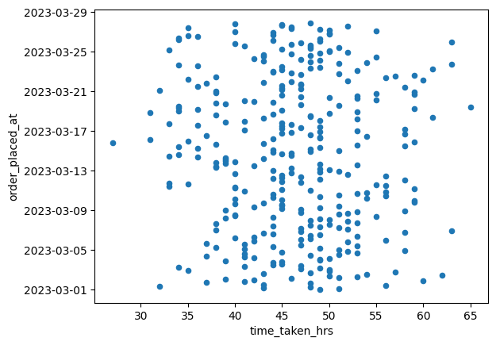

# Diminos Case Study


```python
import pandas as pd
# import numpy as np
import matplotlib.pyplot as plt
import seaborn as sns
%matplotlib inline
```


```python
data = pd.read_csv("data/diminos_data.csv")
data.drop("order_id", axis=1, inplace=True)
```


```python
from datetime import datetime

data.order_placed_at = data.order_placed_at.apply(datetime.fromisoformat)
data.order_delivered_at = data.order_delivered_at.apply(datetime.fromisoformat)
data.shape
```


    (15000, 2)


```python
data.head()
```


<div>
<style>
    .dataframe tbody tr th:only-of-type {
        vertical-align: middle;
    }

    .dataframe tbody tr th {
        vertical-align: top;
    }

    .dataframe thead th {
        text-align: right;
    }
</style>
<table border="1" class="dataframe">
  <thead>
    <tr style="text-align: right;">
      <th></th>
      <th>order_placed_at</th>
      <th>order_delivered_at</th>
    </tr>
  </thead>
  <tbody>
    <tr>
      <th>0</th>
      <td>2023-03-01 00:00:59</td>
      <td>2023-03-01 00:18:07.443132</td>
    </tr>
    <tr>
      <th>1</th>
      <td>2023-03-01 00:03:59</td>
      <td>2023-03-01 00:19:34.925241</td>
    </tr>
    <tr>
      <th>2</th>
      <td>2023-03-01 00:07:22</td>
      <td>2023-03-01 00:22:28.291385</td>
    </tr>
    <tr>
      <th>3</th>
      <td>2023-03-01 00:07:47</td>
      <td>2023-03-01 00:46:19.019399</td>
    </tr>
    <tr>
      <th>4</th>
      <td>2023-03-01 00:09:03</td>
      <td>2023-03-01 00:25:13.619056</td>
    </tr>
  </tbody>
</table>
</div>


```python
data["time_taken_hrs"] = data.order_delivered_at - data.order_placed_at
data.time_taken_hrs = data.time_taken_hrs.apply(lambda x: x.total_seconds() / 60 / 60)
```


```python
data.head()
```


<div>
<style>
    .dataframe tbody tr th:only-of-type {
        vertical-align: middle;
    }

    .dataframe tbody tr th {
        vertical-align: top;
    }

    .dataframe thead th {
        text-align: right;
    }
</style>
<table border="1" class="dataframe">
  <thead>
    <tr style="text-align: right;">
      <th></th>
      <th>order_placed_at</th>
      <th>order_delivered_at</th>
      <th>time_taken_hrs</th>
    </tr>
  </thead>
  <tbody>
    <tr>
      <th>0</th>
      <td>2023-03-01 00:00:59</td>
      <td>2023-03-01 00:18:07.443132</td>
      <td>0.285679</td>
    </tr>
    <tr>
      <th>1</th>
      <td>2023-03-01 00:03:59</td>
      <td>2023-03-01 00:19:34.925241</td>
      <td>0.259979</td>
    </tr>
    <tr>
      <th>2</th>
      <td>2023-03-01 00:07:22</td>
      <td>2023-03-01 00:22:28.291385</td>
      <td>0.251748</td>
    </tr>
    <tr>
      <th>3</th>
      <td>2023-03-01 00:07:47</td>
      <td>2023-03-01 00:46:19.019399</td>
      <td>0.642228</td>
    </tr>
    <tr>
      <th>4</th>
      <td>2023-03-01 00:09:03</td>
      <td>2023-03-01 00:25:13.619056</td>
      <td>0.269616</td>
    </tr>
  </tbody>
</table>
</div>


```python
data.describe()
```


<div>
<style>
    .dataframe tbody tr th:only-of-type {
        vertical-align: middle;
    }

    .dataframe tbody tr th {
        vertical-align: top;
    }

    .dataframe thead th {
        text-align: right;
    }
</style>
<table border="1" class="dataframe">
  <thead>
    <tr style="text-align: right;">
      <th></th>
      <th>time_taken_hrs</th>
    </tr>
  </thead>
  <tbody>
    <tr>
      <th>count</th>
      <td>15000.000000</td>
    </tr>
    <tr>
      <th>mean</th>
      <td>0.341656</td>
    </tr>
    <tr>
      <th>std</th>
      <td>1.602673</td>
    </tr>
    <tr>
      <th>min</th>
      <td>0.250000</td>
    </tr>
    <tr>
      <th>25%</th>
      <td>0.254580</td>
    </tr>
    <tr>
      <th>50%</th>
      <td>0.263300</td>
    </tr>
    <tr>
      <th>75%</th>
      <td>0.287994</td>
    </tr>
    <tr>
      <th>max</th>
      <td>121.663856</td>
    </tr>
  </tbody>
</table>
</div>


```python
sns.boxplot(data)
plt.show()
```


    

    


```python
sns.scatterplot(data)
plt.show()
```


    

    


### According to the above plots we have some outliers but otherwise the delivery time is always under 20 minutes


```python
data1 = data.drop("order_delivered_at", axis=1)
grouped = data1.groupby(pd.Grouper(key="order_placed_at", freq="2H"))
grouped = pd.DataFrame(grouped.size().reset_index(name='time_taken_hrs'))
```


```python
grouped.plot(x="time_taken_hrs", y="order_placed_at", kind="scatter")
plt.show()
```


    

    


### Almost all orders take more than 30 hours to be delivered


```python
grouped[grouped["time_taken_hrs"] < 24].shape
```


    (0, 2)


### All orders take more than a day to be delivered
